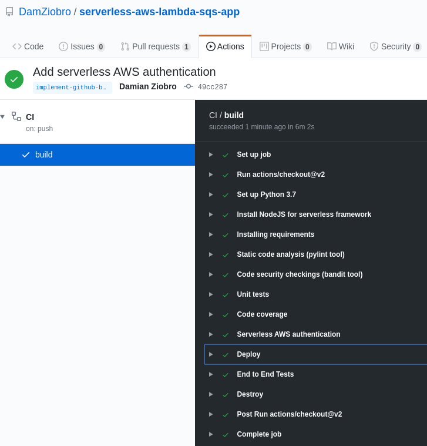
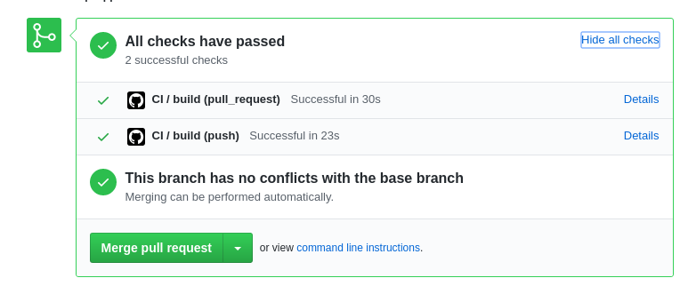
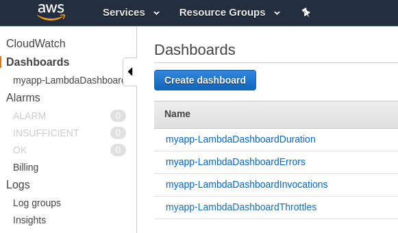

Serverless AWS REST API 
==================

**CI/CD status**:


This simple project is demonstration of multiple modern technologies/methodologies/principles:

  * **Python** programming language
  * cloud-based app deployed to **Amazon Web Services (AWS)**
  * **Serverless** (Serverless Framework) - AWS Lambda, SQS
  * **Microservices** architecture (single resposiblity AWS Lambdas communicating via AWS SQS)
  * **Infrastracture as a Code** (IaaC) (Serverless framework - [serverless.yml](serverless.yml) defines infrastructure resources)
  * **DevOps**-based workflow (common code base with Makefile commands spanning Developers and Operations Teams together)
  * Fully automated **CI/CD pipeline** based on GitHub Actions CI/CD Server
    * code syntax verification (pylint) (`make lint`)
    * security verification (bandit) (`make security`)
    * unit tests (unittest) (`make unittest`)
    * code coverage (coverage python module)  (`make coverage`)
    * deploy infrastructure (AWS, Serverless framework)  (`make deploy`)
    * End-To-End tests (cucumber, pytest-bdd, selenium) (NOT IMPLEMENTED YET) (`make e2e-tests`)
    * load/performance tests (gatling, locust) (NOT IMPLEMENTED YET) (`make load-tests`)
    * destroy infrastructure (AWS, Serverless framework)  (`make destroy`)
  * **deploying from Command Line or from CI/CD** 
    * single Makefile to control all deployment and code checkings commands
    * available to **deploy to multiple stages /environments (ex. DEV, SIT, PROD)** using the same command (ex. `make deploy ENV=SIT`)
    * available to deploy single lambda function (ex. `make deploy FUNC=lambdaFunctionName`)
  * **Monitoring**
    * basic monitoring based on **CloudWatch Dashboards**

This is the skeleton of framework which allows to build and deploy serverless
apps using chain of `AWS Lambda => SQS => AWS Lambda => ...` pattern. 


This framework is based on [a Serverless Application Framework](https://www.serverless.com/)

Quick start
----
1. [**Set up AWS credentials**](https://docs.aws.amazon.com/cli/latest/userguide/cli-chap-configure.html) for your terminal
2. **Install Serverless Application Framework** via npm - [Instruction](https://www.serverless.com/framework/docs/getting-started#via-npm). You can use `make serverless` command from root directory of this project (or `sudo make serverless` if you see `EACCES: permission denied`).
3. **Deploy default app**
```
make deploy
```
4. **Run app and get logs** (logs should contain: `Received message: test_message`)
```
make run
sleep 20 #wait 20 seconds until logs stream is created in AWS
make logs
```
5. **Do changes** in your lambda function **and redeploy** only lambda_function1 function:
```
sed -i 's/test_message/NEW_TEST_MESSAGE/g' app/lambda_function1.py
make deploy FUNC=lambda_function2
```
6. **Run app again and verify that logs** contains your changes (logs should contain: `Received message: NEW_TEST_MESSAGE`):
```
make run
sleep 20 #wait 20 seconds until logs stream is created in AWS
make logs
```
7. **Destroy app** - delete all AWS resources of your app
```
make destroy
```

Stages
----
You can work with app on specified stage (environment) ex. `dev`, `uat`, `prd` by passing ENV variable into the
`make` commands ex.:
```
make deploy ENV=dev
make deploy ENV=uat
make deploy ENV=prd 
```
or export `ENV` variable in your terminal and use default commands ex.
```
export ENV=dev
make deploy run
```

**The default stage for the app is equal to current branch name ex. master**. 

Building and deploying AWS resources
----
`make deploy` will build and deploy infrastructure and code as defined in [serverless.yml](serverless.yml) file:

By default resources are deployed to the default
[stage](https://serverless-stack.com/chapters/stages-in-serverless-framework.html)
(environment) based on current branch name ex. `master`. Thanks to that multiple users working on separate branches can deploy to
separate AWS resources to avoid resources conflicts.

After triggering the above command on `master` branch following resources will be created in your
AWS account:
 - AWS Lambda: `myapp-master-lambda_function2`
 - AWS Lambda: `myapp-master-lambda_function1`
 - AWS SQS queue: `myapp-master-sqs-lambda_function1`


The resources for different stages will be deployed with different names to be
possible to test different versions of app separately. 
For example, if you trigger `make deploy ENV=dev` following resources will be
deployed:
 - `myapp-dev-lambda_function1`
 - `myapp-dev-lambda_function2`
 - `myapp-dev-sqs-lambda_function1`

Tests
----
We have following level of tests in the application:
- `make code-checks` - checks code syntax using `pylint` and security using `bandit` 
- `make unittest coverage` - trigger all unit tests of the code and show code coverage
- `make e2e-tests` (NOT IMPLEMETED YET) - selenium-based tests runned after deployment
- `make load-tests` (NOT IMPLEMENTED YET) 

CI/CD
----
The CI/CD is based on Makefile targets and is integrated with GitHub Actions to
trigger (however it could be easly integrated with any other CI/CD tool ex. 
Jenkins, BitBucket pipelines, GitLab, TravisCI, Bamboo or any other)

It consists of following steps:

Continous Integration
--------
You can run all the below steps/commands using one `make ci` command
- `make lint` => check code syntax using `pylint` tool
- `make security` => check code security breaches using `bandit` tool
- `make unittest` => trigger unit tests and show report
- `make coverage` => show unit tests code coverage

Continous Deployment
--------
You can run all the below steps/commands using one `make cd` command:
- `make deploy` => deploys app to AWS
- `make e2e-tests` => run End to End tests on deployed app
- `make destroy` => (optional: works only on feature branches) destroy AWS
  resources after finishing e2e-tests


CI/CD pipelines
--------
Currently CI/CD is integrated with GitHub Actions. However you can set it up
quickly with any other CI/CD tool and see pipelines and actions similar to the
ones below.

To run CI/CD pipelines you need to export `AWS_KEY` and `AWS_SECRET` to the
`Secrets` section of your GitHub project:


**You can see CI/CD pipelines of project** [here](https://github.com/DamZiobro/serverless-aws-rest-api/actions)

Pipelines of GitHub Actions looks like on this picture:


Pipeline steps are configured in [pipeline config file](.github/workflows/cicd.yml)

Sample pipeline processing with details of each step can be found when you
click on some of the pipelines in [Actions tab](https://github.com/DamZiobro/serverless-aws-rest-api/actions).

It should look like on this picture:


Creating and Merging Pull Requests
--------

To create Pull Request, go to [Pull Requests](https://github.com/DamZiobro/serverless-aws-rest-api/pulls) and
fo following steps: 
1. Click 'New pull request'
2. Select your branch and click on it.
3. Make sure you selected your PR to be merged into `develop` (NOT `master`)
   (we will use GitFlow for releases later)
4. Click create Pull Request

When you follow above actions, the CI/CD pipeline will be triggered automatically and perform all checkings described in CI/CD section above.

When everything will be finished you should see results like here and if
everything is green you can ask your colleague for Code Review. 

If something is not green, you should fix it before asking Code Review.


When you Code is reviewed you can click 'Merge pull request' and merge it into
`develop` branch.

Monitoring
--------
This application has integrated basic monitoring based on **CloudWatch Dashboards**. 
It is based on [serverless-plugin-cloudwatch-dashboard](https://www.serverless.com/plugins/serverless-plugin-cloudwatch-dashboard/) Serverless framework plugin.

Deployment of [serverless.yml](serverless.yml) creates 4 CloudWatch Dashboardss for AWS
Lambda monitoring as on the picture:

